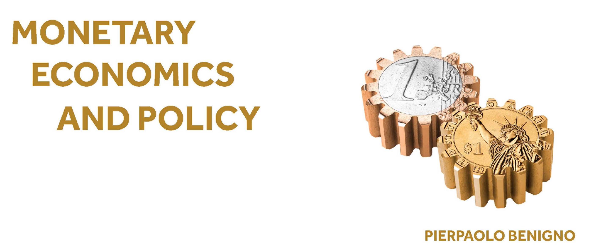

# Lecture Materials

**Based on:** *Monetary Economics and Policy: A Foundation for Modern Currency Systems* by Pierpaolo Benigno.

**Get the Book:** [Princeton University Press](https://press.princeton.edu/books/hardcover/9780691262642/monetary-economics-and-policy) | [Amazon](https://www.amazon.com/Monetary-Economics-Policy-Foundation-Currency/dp/0691262640/ref=sr_1_3?dib=eyJ2IjoiMSJ9.BnDgaAdZJ9QXQOg7jfYG7fwDZQzOvGY-suFQZKPmwYTqmU3FWd-AO7YxnubK0Pwc.58CLJVpMjjn5znGw7Yup5ztMq1vatAvMl0L9L_y7abs&dib_tag=se&qid=1768125138&refinements=p_27%3APierpaolo+Benigno&s=books&sr=1-3).

**Authors:** Pierpaolo Benigno, Marcos Consuegra Lopez and Severin Rothen.

---

## 📌 Overview
This repository contains the complete set of lecture slides for lectures on Monetary Economics based on the book "Monetary Economics and Policy: A Foundation for Modern Currency Systems" by *Pierpaolo Benigno*. We are making the **LaTeX source code** public to allow instructors and students to adapt, edit, and reorganize the material for their own educational use.

## 🛠 Technical Requirements
To compile the slides and ensure all content renders correctly, you must download the entire folder structure. The project depends on the following components:

* **Graphics & Figures:** All images and graphs are stored in relative paths (`code/images`). The images must be loaded in your LaTeX environment for them to appear.
* **Bibliography:** The `references.bib` file must be loaded in your LaTeX environment for citations to appear.

---

## 📂 Content

The material is organized into 14 chapters. Click the links below to access the **LaTeX source code** for each chapter:

### Part I: Currency and Money
* Chapter 1: The Value of Currency ([PDF](./pdf/Chapter1.pdf)/[.tex](./code/tex/Chapter1.tex))
* Chapter 2: Cash as a Medium of Exchange
* Chapter 3: Central Bank Digital Currency
* Chapter 4: Private Money

### Part II: Stabilization Policies
* Chapter 5: The Benchmark New Keynesian Model
* Chapter 6: An AS-AD Graphical Analysis
* Chapter 7: Inflation Targeting as an Optimal Policy
* Chapter 8: NK Model with a Banking Sector

### Part III: Crisis Models
* Chapter 9: Liquidity Trap
* Chapter 10: Deleveraging and Credit Crunch
* Chapter 11: Shortage of “Safe Assets”
### Part IV: Inflation
* Chapter 12: The Inflation-Unemployment Trade-Off
* Chapter 13: Hyperinflation

### Part V: Conclusion
* The Future of Monetary Policy

---

## ⚖️ Usage & Attribution
These materials are provided for educational purposes. You are free to modify and redistribute the code, provided that:
1. Reference is made to the textbook by **Pierpaolo Benigno**.
2. Original attribution is given to **Severin Rothen** and **Marcos Consuegra Lopez**.
3. 
For the official version of these slides, visit also [Professor Benigno's Website](https://benigno.ch/).
